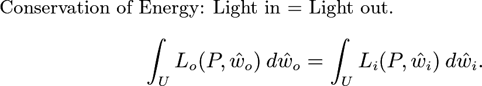
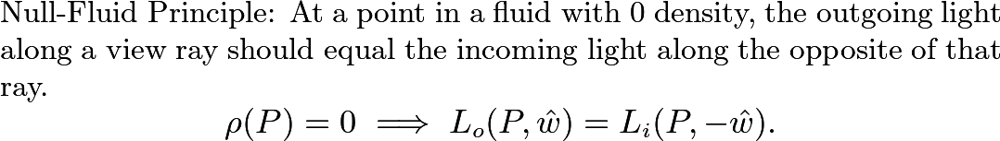
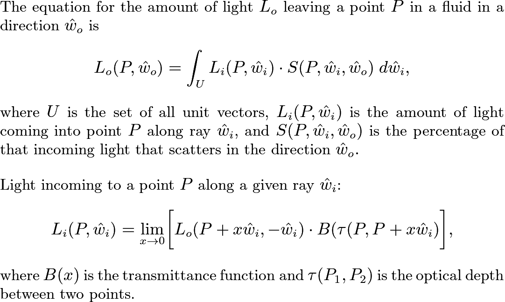

# Fluid Renderer
The goal of this project is to create a physics-based screen-space rendering algorithm for general fluids. This renderer should be highly customizable to work for any sort of fluid, including but not limited to atmospheric gas, clouds, water, and other liquids. I'm aiming to make this easily mesh with any sort of fluid simulation by only requiring a density function to sample the density of the fluid at any point. Everything else gets handled by the renderer. Hopefully, this is fast enough to handle rendering multiple fluids at once. So far this has worked great for gases, but liquids are proving to be more difficult.

## Tasks
- ~~Get Shader skeleton up~~
- ~~Optical Depth function~~
- ~~Beer-Lambert Law~~
- ~~Basic In-Scattering~~
- ~~Weighting In-Scattered light by its angle relative to the view ray~~
- Figure out how phase weight function works
- ~~Add option for switching between Rayleigh and Mie scattering~~
- Allow multiple fluids to be rendered at once
- Research water/liquid renderers

## Fluid Lighting Laws
In an attempt to try to reconcile my increasing headache, I've started to lay out some rules that the equations must obey. I've pulled these from physics principles, my own observation/common sense, and thin air.

I plan to be adding to these as I think of them or find them from other sources. Hopefully this will help me get a grip on what exactly the equations should look like.

## Fluid Lighting Equations

So far I've based the rendering strategy off of this general fluid lighting equation that I've derived from my own personal logic and looking at other people's code. Is it a sloppy use of notation and vaguely defined in some places? Definitely (Though I hope to make it less so in the future). Is it physically accurate? Who knows! :D

So in order to get this to line up with the technique I'm currently using in the shader (because that seems to work well), I've been thinking about playing around with the scattering function. Mainly, that when the incoming direction and the outgoing direction are the same, the density should also keep some of that light from scattering forward, or something. Basically, when the density is 0, the light scattered should be 1 if we're looking in the direction of the light. Been thinking about using exponentials or lerping to do this.